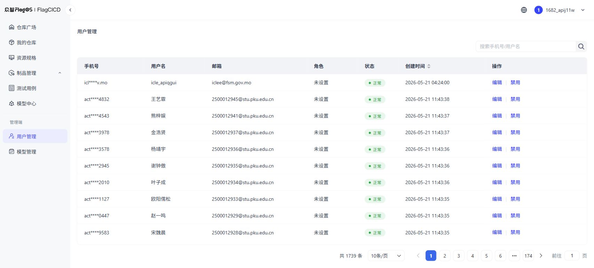
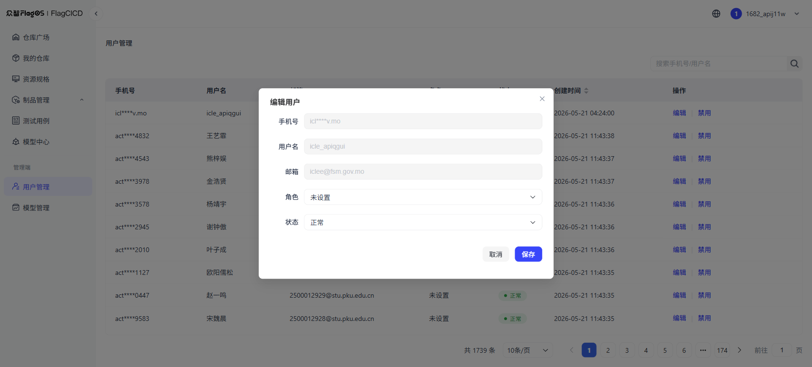

# 用户管理

用户管理页面用于管理平台用户（管理端功能）。

## 访问路径

左侧导航栏 → **管理端** → **用户管理**

## 搜索功能

支持按手机号或用户名搜索。

## 列表字段

| 列名 | 说明 |
|------|------|
| 手机号 | 用户手机号 |
| 用户名 | 用户名称 |
| 角色 | 用户角色 |
| 状态 | 用户状态 |

## 角色类型

| 角色 | 权限说明 |
|------|------|
| {term}`平台管理员` | 用户端及管理端所有权限，包含特权用户 |
| {term}`特权用户` | 新建 runner（DooD 和 DinD 选型可见） |
| {term}`普通用户` | 用户端所有菜单 |

## 用户状态

| 状态 | 说明 |
|------|------|
| 正常 | 可正常使用平台 |
| 禁用 | 无法登录平台 |

## 操作说明

- **分配角色**：点击用户行的角色字段，选择要分配的角色
- **禁用/启用**：点击用户行的状态字段，切换用户状态

