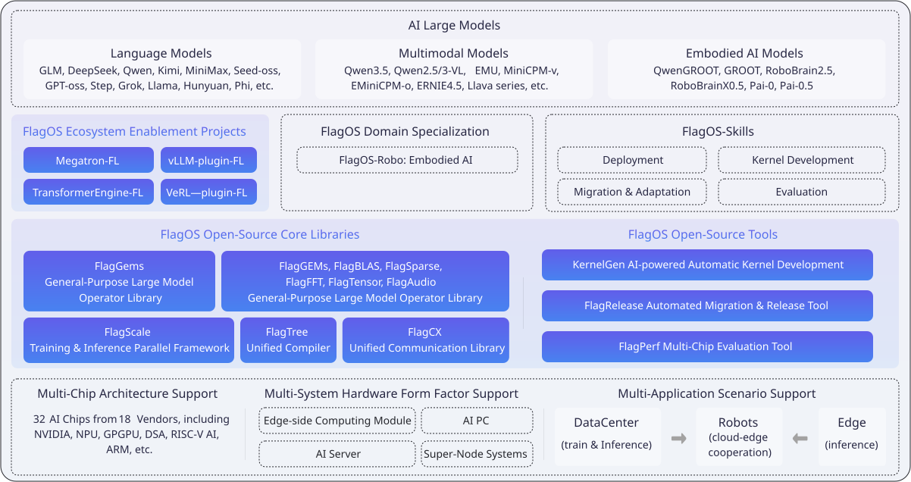

# FlagOS Overview

FlagOS is a fully open-source AI system software stack for heterogeneous AI chips, allowing AI models to be developed once and seamlessly ported to a wide range of AI hardware with minimal effort.

## FlagOS architecture

The figure below shows the position of FlagOS in the AI ecosystem and its composition modules.

FlagOS 2.0 comprises four core libraries: the operator library FlagGems 5.0.0, the compiler FlagTree 0.5.0, the communication library FlagCX 0.11.0, and the parallel framework FlagScale 1.0.0; three open-source tools: FlagPerf, FlagRelease, and KernelGen 2.0; and four ecosystem enablement models: TransformerEngine-FL v0.1.0+te2.9.0, Megatron-LM-FL v0.1.0+megatron0.15.0rc7, vllm-plugin-FL v0.1.0+vllm0.13.0, and verl-FL v0.1.0+verl0.7.0; embodied intelligence module: FlagOS Robo ; and agent skills module: FlagOS Skills 1.0.

### Open-source core libraries

- **FlagGems**

  FlagGems is a high-performance general-purpose operator library implemented with the Triton programming language and its extended languages. FlagGems is designed to provide a suite of general-purpose operators for large models, accelerating the inference and training of models across multiple backend platforms.

- **FlagTree**

  FlagTree is an open-source, unified compiler for multiple AI chips. FlagTree is dedicated to building a compiler and associated tooling platform for diverse AI chips, advancing and expanding the upstream and downstream Triton ecosystem, with the goals of supporting existing adaptation solutions, unifying code repositories, and enabling rapid multi-backend support from a single repository. For upstream model users, FlagTree provides unified compilation support across multiple backends; for downstream chip vendors, FlagTree offers reference implementations for integration into the Triton ecosystem.

- **FlagScale**
  
  FlagScale is a comprehensive toolkit designed to support the entire lifecycle of large models. FlagScale builds on the strengths of several prominent open-source projects, including Megatron-LM and vLLM, to provide a robust, end-to-end solution for managing and scaling large models.

- **FlagCX**

  FlagCX is a scalable and adaptive unified communication library for cross-chip environments. FlagCX delivers high-performance point-to-point and collective communication capabilities tailored for multi-chip, multi-platform scenarios. By leveraging the native collective communication capabilities of each platform, FlagCX incorporates technologies such as device-buffer IPC and RDMA to enable highly efficient collective communication in both cross-chip and single-chip scenarios, while also providing adaptive tuning capabilities for communication optimization.

### Open-source tools

- **KernelGen**
  KernelGen is an operator auto-generation tool. KernelGen is designed to construct operator definitions through natural language prompts, retrieve existing similar operator definitions, automatically execute operator accuracy and performance testing, generate accuracy and performance test results, and produce Triton Kernels.

- **FlagRelease**
  FlagRelease is a platform dedicated to the automatic migration, adaptation and release of large models for multi-architecture AI chips. FlagRelease aims to enable mainstream large models to be migrated, validated, and released on diverse domestic AI hardware with lower cost and higher efficiency through automated, standardized, and intelligent adaptation workflows.

- **FlagPerf**
  FlagPerf is an integrated AI hardware evaluation engine. FlagPerf aims to establish an industry practice-oriented indicator system and evaluate the actual performance of AI hardware under combinations of software stacks (model + framework + compiler).

### Ecosystem enablement modules

The FlagOS ecosystem enablement layer adopts a plugin architecture composed of the following modules. Each module bridges an upstream library and its backend engine with the FlagOS core libraries via FlagScale.

- **TransformerEngine-FL**
  
  TransformerEngine-FL extends the transformer acceleration capabilities of Transformer Engine to diverse AI chips, enabling hardware-agnostic training acceleration.

- **Megatron-LM-FL**
  
  Megatron-LM-FL extends the distributed training capabilities of Megatron-LM to diverse AI chips, supporting scalable large-model training across heterogeneous hardware.

- **vllm-plugin-FL**
  
  vllm-plugin-FL extends the inference capabilities of vLLM to diverse AI chips, enabling efficient model serving beyond the original supported hardware.

- **verl-FL**
  
  verl-FL extends the reinforcement learning capabilities of veRL to diverse AI chips, broadening the hardware coverage for RL-based training workflows.

Each module also supports standalone use. When only one or two capabilities are required — such as training, inference, or reinforcement learning — the corresponding module can independently bridge its upstream library and backend engine with the relevant FlagOS core library modules, offering the flexibility to meet diverse user deployment scenarios.

### Domain-specific module and FlagOS Skills

- **FlagOS-Robo**
  
  FlagOS-Robo is a chip-agnostic framework for training and deploying Vision Language Models (VLMs) and Vision Language Action (VLA) models across edge-to-cloud scenarios in Embodied Intelligence. It treats VLMs as the “brain” for task planning and VLA models as the “cerebellum” for generating robot control actions.

- **FlagOS Skills**

  FlagOS Skills are agent-compatible capabilities designed to streamline key FlagOS workflows, including deployment, operator development, migration, adoption, and performance evaluation.
Capabilities and advantages of FlagOS
