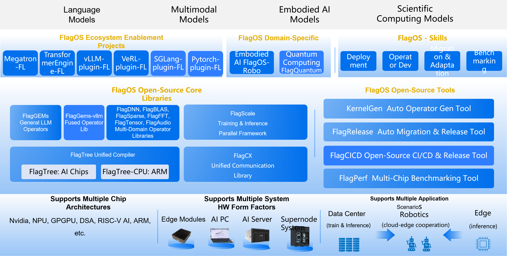

# FlagOS Overview

FlagOS is a fully open-source AI system software stack for heterogeneous AI chips, allowing AI models to be developed once and seamlessly ported to a wide range of AI hardware with minimal effort.

```{note}
This is a preview release. The version number shown is a pre-release identifier and may change upon final release. Content in this preview is for reference only and does not constitute a commitment or warranty for the final product.
```

## FlagOS architecture

The figure below shows the position of FlagOS in the AI ecosystem and its composition modules.



FlagOS 2.1 comprises four core libraries, six operator libraries, six ecosystem enablement plugins, two domain-specific projects, three developer tools, and three platform services.

### Open-source core libraries

- **FlagGems** (v5.3.0)

  FlagGems is a high-performance general-purpose operator library implemented with the Triton programming language and its extended languages. FlagGems is designed to provide a suite of general-purpose operators for large models, accelerating the inference and training of models across multiple backend platforms.

- **FlagTree** (v0.6.0)

  FlagTree is an open-source, unified compiler for multiple AI chips. FlagTree is dedicated to building a compiler and associated tooling platform for diverse AI chips, advancing and expanding the upstream and downstream Triton ecosystem, with the goals of supporting existing adaptation solutions, unifying code repositories, and enabling rapid multi-backend support from a single repository. For upstream model users, FlagTree provides unified compilation support across multiple backends; for downstream chip vendors, FlagTree offers reference implementations for integration into the Triton ecosystem.

- **FlagScale** (v2.0.0)

  FlagScale is a comprehensive toolkit designed to support the entire lifecycle of large models. FlagScale builds on the strengths of several prominent open-source projects, including Megatron-LM and vLLM, to provide a robust, end-to-end solution for managing and scaling large models.

- **FlagCX** (v0.13.0)

  FlagCX is a scalable and adaptive unified communication library for cross-chip environments. FlagCX delivers high-performance point-to-point and collective communication capabilities tailored for multi-chip, multi-platform scenarios. By leveraging the native collective communication capabilities of each platform, FlagCX incorporates technologies such as device-buffer IPC and RDMA to enable highly efficient collective communication in both cross-chip and single-chip scenarios, while also providing adaptive tuning capabilities for communication optimization.

### Operator libraries

- **FlagGems-vllm** (v0.1.0)

  A high-performance operator library designed for multiple hardware backends. It provides optimized implementations of common vLLM operators and supports high-performance inference and deployment for a variety of widely used models.

- **FlagDNN** (v0.2.0)

  A deep neural network computing library oriented towards multiple chip backends. It provides high-performance implementations of common deep learning operators.

- **FlagBLAS** (v0.2.0)

  A computing library that follows the BLAS standard interface and is oriented towards multiple chip backends. It defines core operations for numerical calculations.

- **FlagFFT** (v0.1.0)

  A JIT-compiled GPU FFT library. It generates CUDA kernels at runtime via Triton/TLE and libtriton_jit, targeting arbitrary-length transforms that cuFFT does not optimally support.

- **FlagSparse** (v0.2.0)

  A domain-specific operator library that contains operators dedicated to sparse computation scenarios.

- **FlagTensor** (v0.2.0)

  A high-performance tensor-primitive library implemented in Triton language. It provides optimized implementations of common tensor primitives (unary, binary, and tensor contraction operations) benchmarked against cuTensor baselines.

- **FlagAudio** (v0.2.0)

  A multi-backend computing library that adheres to Audio standard interfaces. It delivers a high-performance computing solution designed for audio signal processing and speech AI applications.

### Ecosystem enablement plugins

The FlagOS ecosystem enablement layer adopts a plugin architecture composed of the following modules. Each module bridges an upstream library and its backend engine with the FlagOS core libraries.

- **vllm-plugin-FL** (v0.2.0)

  vllm-plugin-FL extends the inference capabilities of vLLM to diverse AI chips, enabling efficient model serving beyond the original supported hardware. Built on FlagOS's unified multi-chip backend — including the unified operator library FlagGems and the unified communication library FlagCX.

- **sglang-plugin-FL** (v0.1.0)

  sglang-plugin-FL is an out-of-tree (OOT) plugin for SGLang, built on FlagOS's unified multi-chip backend. It extends SGLang's inference capabilities across diverse hardware platforms.

- **PyTorch-Plugin-FL** (v0.1.0)

  PyTorch-Plugin-FL is a custom PyTorch device plugin based on the PrivateUse1 extension mechanism, registering FlagGems high-performance Triton operators as the flagos device backend for unified multi-chip support.

- **Megatron-LM-FL** (v0.2.0)

  Megatron-LM-FL extends the distributed training capabilities of Megatron-LM to diverse AI chips, supporting scalable large-model training across heterogeneous hardware.

- **TransformerEngine-FL** (v0.2.0)

  TransformerEngine-FL extends the transformer acceleration capabilities of Transformer Engine to diverse AI chips, enabling hardware-agnostic training acceleration.

- **verl-FL** (v0.2.0)

  verl-FL extends the reinforcement learning capabilities of veRL to diverse AI chips, broadening the hardware coverage for RL-based training workflows.

All six plugins support standalone use. vllm-plugin-FL, Megatron-LM-FL, TransformerEngine-FL, and verl-FL can also be used together with FlagScale. When only one or two capabilities are required — such as training, inference, or reinforcement learning — the corresponding module can independently bridge its upstream library and backend engine with the relevant FlagOS core library modules, offering the flexibility to meet diverse user deployment scenarios.

### Domain-specific projects

- **FlagOS-Robo** (v0.1.0)

  FlagOS-Robo is a chip-agnostic framework for training and deploying Vision Language Models (VLMs) and Vision Language Action (VLA) models across edge-to-cloud scenarios in Embodied Intelligence. It treats VLMs as the "brain" for task planning and VLA models as the "cerebellum" for generating robot control actions.

- **FlagQuantum** (v0.1.0)

  FlagQuantum is a high-performance distributed quantum statevector simulator built on PyTorch, enabling quantum circuit simulation across multiple GPUs with automatic sharding and resharding.

### Developer tools

- **KernelGen** (v2.1)

  KernelGen is an operator auto-generation tool. KernelGen is designed to construct operator definitions through natural language prompts, retrieve existing similar operator definitions, automatically execute operator accuracy and performance testing, generate accuracy and performance test results, and produce Triton Kernels.

- **FlagOS Skills** (v1.1.0)

  FlagOS Skills are agent-compatible capabilities designed to streamline key FlagOS workflows, including deployment, operator development, migration, adoption, and performance evaluation. Compatible with Claude Code, Cursor, Codex, and any agent supporting the Agent Skills standard.

- **Online Laboratory**

  An online laboratory providing cloud-based development environments for FlagOS projects.

### Platform services

- **FlagRelease** (v0.2.0)

  FlagRelease is a platform dedicated to the automatic migration, adaptation and release of large models for multi-architecture AI chips. FlagRelease aims to enable mainstream large models to be migrated, validated, and released on diverse domestic AI hardware with lower cost and higher efficiency through automated, standardized, and intelligent adaptation workflows.

- **FlagPerf** (v1.2)

  FlagPerf is an integrated AI hardware evaluation engine. FlagPerf aims to establish an industry practice-oriented indicator system and evaluate the actual performance of AI hardware under combinations of software stacks (model + framework + compiler).

- **FlagCICD** (v0.1.0)

  FlagCICD is a CI/CD toolchain that streamlines large-model development across diverse AI chips, eliminating fragmentation and cutting adaptation costs.

- **KernelGenBench** (v0.1.0)

  KernelGenBench is a benchmark framework for evaluating LLM and agent-based Triton kernel generation across multiple hardware platforms.
