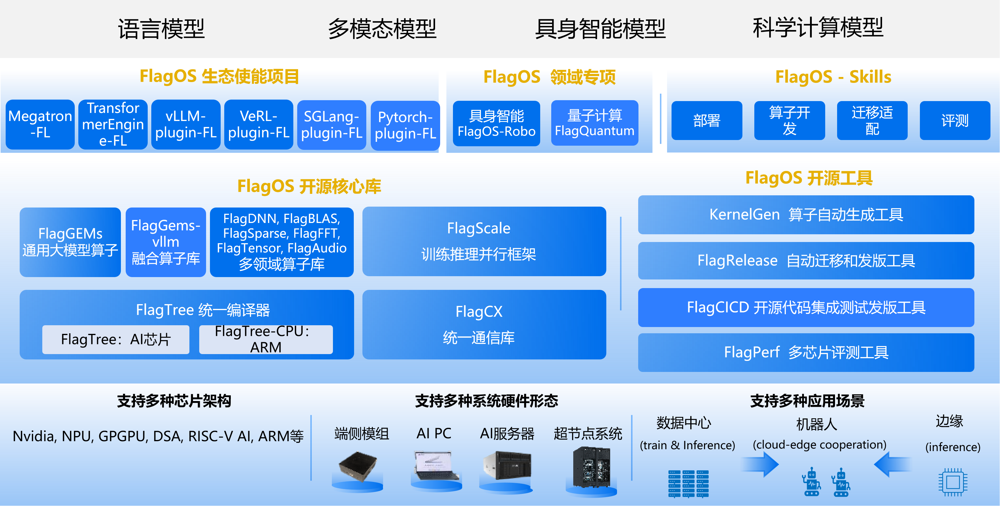

# FlagOS 概览

FlagOS 是一款面向异构 AI 芯片的全开源 AI 系统软件栈，使 AI 模型能够一次开发、无缝迁移到多种 AI 硬件，极大降低适配成本。

## FlagOS 架构

下图展示了 FlagOS 在 AI 生态中的定位及其组成模块。

FlagOS 2.1 包含四个核心库、六个算子库、六个生态插件、两个领域项目、三个开发工具和三个平台服务。

### 开源核心库

- **FlagGems**（v5.0.2）

  FlagGems 是一款使用 Triton 编程语言及其扩展语言实现的高性能通用算子库。旨在为大模型提供一系列通用算子，加速模型面向多种后端平台的推理与训练。

- **FlagTree**（v0.6.0）

  FlagTree 是一款面向多种 AI 芯片的开源、统一编译器。致力于打造多元 AI 芯片编译器及相关工具平台，发展和壮大 Triton 上下游生态，目标是兼容现有适配方案，统一代码仓库，快速实现单仓库多后端支持。对于上游模型用户，FlagTree 提供多后端的统一编译能力；对于下游芯片厂商，提供 Triton 生态接入范例。

- **FlagScale**（v2.0.0）

  FlagScale 是一款全流程大模型工具集，可支持大模型的完整生命周期管理。该工具集依托 Megatron-LM 和 vLLM 等多款主流开源项目的技术优势，为大模型的管理与规模化部署提供了一套可靠的端到端解决方案。

- **FlagCX**

  FlagCX 是一款可扩展、自适应的跨芯片统一通信库。能面向多芯片、多平台场景，提供高性能的点对点与集合通信能力。在复用各平台原生集合通信能力的基础上，引入自主的设备缓冲区 IPC 与 RDMA 等技术，实现跨芯片与单芯片场景下的高效集合通信，并提供通信的自适应调优能力。

### 算子库

- **FlagGems-vllm**（v0.1.0）

  一款面向多种硬件后端的高性能算子库，提供常用 vLLM 算子的优化实现，支持多种主流模型的高性能推理与部署。

- **FlagDNN**（v0.2.0）

  一款面向多种芯片后端的深度神经网络计算库，提供常用深度学习算子的高性能实现。

- **FlagBLAS**（v0.2.0）

  一款遵循 BLAS 标准接口、面向多种芯片后端的计算库，定义数值计算的核心操作。

- **FlagFFT**（v0.1.0）

  一款 JIT 编译的 GPU FFT 库，通过 Triton/TLE 和 libtriton_jit 在运行时生成 CUDA 内核，针对 cuFFT 无法优化支持的任意长度变换。

- **FlagSparse**（v0.2.0）

  一款领域专用算子库，包含专用于稀疏计算场景的算子。

- **FlagTensor**（v0.2.0）

  一款使用 Triton 语言实现的高性能张量原语库，提供常用张量原语（一元、二元和张量收缩操作）的优化实现，以 cuTensor 为基准进行性能对标。

- **FlagAudio**（v0.2.0）

  一款遵循 Audio 标准接口的多后端计算库，为音频信号处理和语音 AI 应用提供高性能计算解决方案。

### 生态插件

FlagOS 生态适配层采用插件架构，由以下模块组成。每个模块将上游库及其后端引擎与 FlagOS 核心库连接起来。

- **vllm-plugin-FL**（v0.2.0）

  vllm-plugin-FL 将 vLLM 的推理能力扩展到多种 AI 芯片，实现超越原始支持硬件的高效模型服务。基于 FlagOS 的统一多芯片后端构建——包括统一算子库 FlagGems 和统一通信库 FlagCX。

- **sglang-plugin-FL**（v0.1.0）

  sglang-plugin-FL 是 SGLang 的树外（OOT）插件，基于 FlagOS 的统一多芯片后端构建，将 SGLang 的推理能力扩展到多种硬件平台。

- **PyTorch-Plugin-FL**（v0.1.0）

  PyTorch-Plugin-FL 是基于 PrivateUse1 扩展机制的自定义 PyTorch 设备插件，将 FlagGems 高性能 Triton 算子注册为 flagos 设备后端，实现统一的多芯片支持。

- **Megatron-LM-FL**（v0.2.0）

  Megatron-LM-FL 将 Megatron-LM 的分布式训练能力扩展到多种 AI 芯片，支持跨异构硬件的大规模模型训练。

- **TransformerEngine-FL**（v0.2.0）

  TransformerEngine-FL 将 Transformer Engine 的 Transformer 加速能力扩展到多种 AI 芯片，实现硬件无关的训练加速。

- **verl-FL**（v0.2.0）

  verl-FL 将 veRL 的强化学习能力扩展到多种 AI 芯片，拓宽 RL 训练工作流的硬件覆盖范围。

以上六个插件均支持独立使用。其中 vllm-plugin-FL、Megatron-LM-FL、TransformerEngine-FL 和 verl-FL 还可与 FlagScale 一起使用。当仅需要训练、推理或强化学习等一两种能力时，对应的模块可独立将其上游库和后端引擎与相关的 FlagOS 核心库模块连接，灵活满足多样化的用户部署场景。

### 领域项目

- **FlagOS-Robo**（v0.1.0）

  FlagOS-Robo 是一款芯片无关的框架，用于在具身智能的边端到云端场景中训练和部署视觉语言模型（VLM）和视觉语言动作（VLA）模型。它将 VLM 视为任务规划的"大脑"，将 VLA 模型视为生成机器人控制动作的"小脑"。

- **FlagQuantum**（v0.1.0）

  FlagQuantum 是一款基于 PyTorch 构建的高性能分布式量子态向量模拟器，支持多 GPU 上的量子电路模拟，具备自动分片和重分片能力。

### 开发工具

- **KernelGen**（v2.1）

  KernelGen 是一款算子自动生成工具。旨在通过自然语言提示构建算子定义，检索现有相似算子定义，自动完成算子准确率及性能测试，生成准确率及性能测试结果，并生成 Triton 算子。

- **FlagOS Skills**（v1.1.0）

  FlagOS Skills 是一组面向智能体的能力模块，旨在简化 FlagOS 关键工作流，包括部署、算子开发、迁移、适配和性能评估。兼容 Claude Code、Cursor、Codex 以及任何支持 Agent Skills 标准的智能体。

- **Online Laboratory**

  为 FlagOS 项目提供云端开发环境的在线实验室。

### 平台服务

- **FlagRelease**（v0.2.0）

  FlagRelease 是一款面向多架构 AI 芯片的大模型自动迁移、适配与发布平台。旨在通过自动化、标准化和智能化的适配流程，使主流大模型能够在不同国产 AI 芯片上以更低成本、更高效率完成模型迁移、验证与发版。

- **FlagPerf**（v1.2）

  FlagPerf 是一款一体化 AI 硬件评测引擎。旨在建立以产业实践为导向的指标体系，评测 AI 硬件在软件栈组合（模型+框架+编译器）下的实际能力。

- **FlagCICD**

  FlagCICD 是一款 CI/CD 工具链，用于简化跨多种 AI 芯片的大模型开发，消除碎片化并降低适配成本。

- **KernelGenBench**（v0.1.0）

  KernelGenBench 是一个用于评估 LLM 和智能体驱动的 Triton 算子生成能力的基准框架，支持多种硬件平台。
