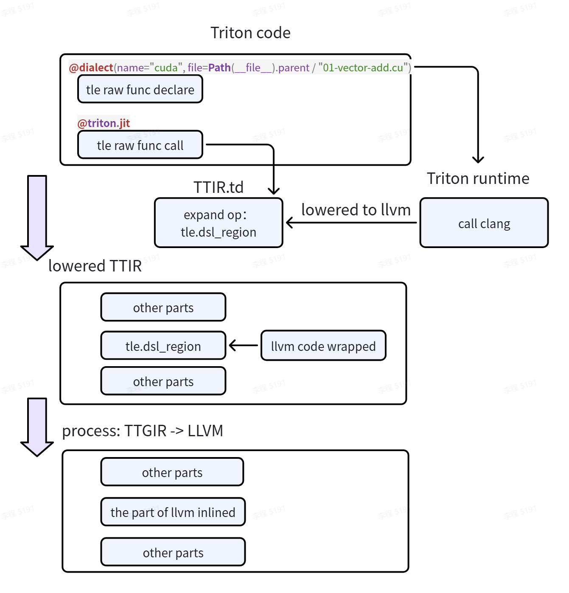
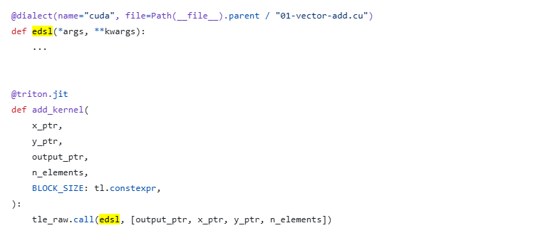
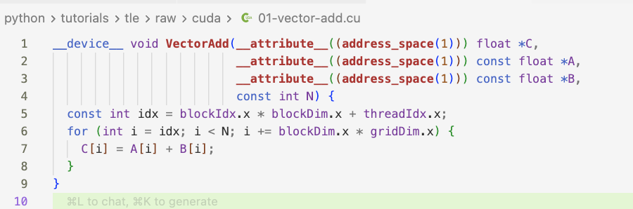
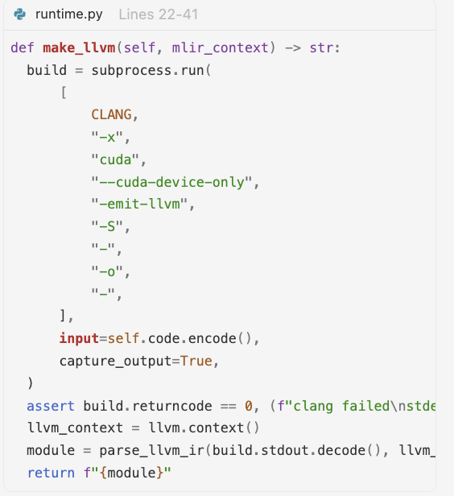
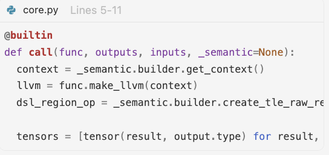
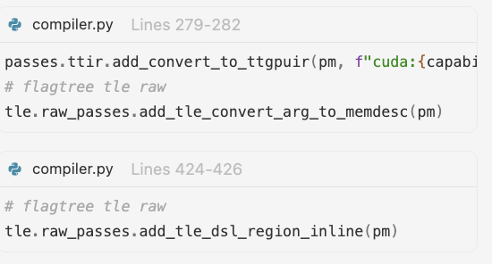

# Use TLE-Raw

This section introduces how to use TLE-Raw. TLE-Raw is available on trition_3.6.x branch.

## MLIR

The following is an example of MLIR (Multi-Level Intermediate Representation).

```{code-block} python
from typing import Annotated
from mlir import ir
from mlir.dialects import arith, nvvm, tensor
import triton.language as tl
from triton.experimental.flagtree.edsl import dialect
import triton.experimental.flagtree.language as fl

# 1. Dialect declaration
@tle.raw.language(name="mlir")
# 2. Hardware constraint
@tle.hardware_constraint(threads_dim=1, sync_scope="block")
# 3. Function implementation
def vector_add_tile(
    x: Annotated[ir.RankedTensorType, "tensor<1024xf32>"],
    y: Annotated[ir.RankedTensorType, "tensor<1024xf32>"],
    output: Annotated[ir.RankedTensorType, "tensor<1024xf32>"]
):
    # Write low-level operations directly using the MLIR Python bindings
    tidx = nvvm.ThreadIdXOp(ir.IntegerType.get_signless(32)).res
    bidx = nvvm.BlockIdXOp(ir.IntegerType.get_signless(32)).res
    bdimx = nvvm.BlockDimXOp(ir.IntegerType.get_signless(32)).res
    idx = arith.addi(arith.muli(bidx, bdimx), tidx)
    idx = arith.index_cast(ir.IndexType.get(), idx)
    xval = tensor.extract(x, [idx])
    yval = tensor.extract(y, [idx])
    result = arith.addf(xval, yval)
    tensor.insert(result, output, [idx])

@tle.jit
def add_kernel(
    x_ptr, y_ptr, output_ptr,
    n_elements,
    BLOCK_SIZE: tl.constexpr,
):
    #  Tile language main code
    pid = tl.program_id(axis=0)
    block_start = pid * BLOCK_SIZE
    offsets = block_start + tl.arange(0, BLOCK_SIZE)
    mask = offsets < n_elements
    x = tl.load(x_ptr + offsets, mask=mask)
    y = tl.load(y_ptr + offsets, mask=mask)
    output = tl.zeros_like(x)
    
    # 4. Function call
    tle.call(
        vector_add_tile,
        args=[x, y, output],
        hardware={
            "threads": (BLOCK_SIZE,),  # Must satisfies threads_dim=1
        },
        layout={
            x: {"space": "shared", "order": [0]},      # Shared memory, one-dimensional layout (for optimizing connection)
            y: {"space": "shared", "order": [0]},
            output: {"space": "shared", "order": [0]}
        }
    )
    tl.store(output_ptr + offsets, output, mask=mask)
```

TLE-raw consists of the following four parts:

- Dialect declaration (decorator)
  - Decorator: `@tle.raw.language(name="mlir")`
  - Explanation: This decorator marks the function `vector_add_tile` as a block of code written directly in the MLIR dialect. It tells the compiler, specifically through the FlagTree EDSL (Embedded Domain Specific Language), that the body of this function should be interpreted and lowered using MLIR operations (such as `nvvm`, `arith`, and `tensor`), rather than standard Python or Triton operations.
- Hardware constraint (decorator)
  - Decorator: `@tle.hardware_constraint(threads_dim=1, sync_scope="block")`
  - Explanation: This decorator imposes constraints on the hardware execution model for the `vector_add_tile` function. It specifies that the function operates in a 1-dimensional thread space (`threads_dim=1`) and that synchronization primitives should be scoped at the block level (`sync_scope="block"`).
- Function implementation
  - Function: `vector_add_tile(...)`
  - Explanation: This is the actual implementation of the computation kernel written using low-level MLIR Python bindings. It defines the specific operations (thread indexing, memory loading, floating-point addition, and memory storing) that will be executed by the hardware. The function signature uses Annotated types to explicitly define the input and output as `tensor<1024xf32>` (1024-element float32 tensors), ensuring the compiler knows the exact data layout and types to expect.
- Function call
  - Invocation: `tle.call(vector_add_tile, args=[x, y, output], hardware={...}, layout={...})`
  - Explanation: This line invokes the declared MLIR function (`vector_add_tile`) from within the high-level Triton kernel (`add_kernel`). It passes the input tensors `x`, `y`, and the output buffer. Crucially, it provides hardware mapping hints (defining the number of threads) and memory layout specifications (defining the tensors as residing in "shared" memory with a specific order). This allows the compiler to bridge the gap between the high-level `tl.load`/`tl.store` operations and the low-level MLIR IR generation.

## Integrate CUDA kernel via the LLVM inline path

TLE-Raw supports CUDA kernel integration via the LLVM inline path. Vendors integrating TLE-Raw on the CUDA side should evaluate:

- Whether clang can generate LLVM IR and serialize it as text
- Whether TTGIR-related pass operations can be reused or adapted

### LLVM route

Basic flow: use clang to translate CUDA code into LLVM IR, then apply the existing LLVM inline pass.



#### Usage example

- Reference: `python/tutorials/tle/raw/cuda/01-vector-add.py`

- Triton side: provide the CUDA file path and function declaration.
 

- CUDA side: implement the CUDA kernel. LLVM struct parameter declarations are still retained (because subsequent inlining requires handling the Triton ptr-to-LLVM conversion, which is currently left to the user for one-to-one mapping).

 

#### Processing flow

##### Frontend: CUDA-LLVM integration into Triton frontend and runtime

| Step | Module | Key Pass Development |
|---|---|---|
| Dialect registration entry (dialect decorator) | `python/triton/experimental/tle/raw/runtime.py` | - Maintains `registry = {"cuda": CUDAJITFunction, "mlir": MLIRJITFunction}`.</br> - `dialect(name="cuda", ...)` constructs a `CUDAJITFunction` object. |
| TTIR extension: `Tle_DSLRegionOp` | `FlagTree/third_party/tle/dialect/include/IR/TleOps.td` | - Accepts Triton parameters; <br> - wraps LLVM IR into the region field. |
| CUDA runtime: where clang is actually invoked | `python/triton/experimental/tle/raw/cuda/runtime.py` | - `CUDAJITFunction` reads the `.cu` source text at initialization.</br> - `make_llvm()` directly calls `subprocess.run(clang ...)` to produce LLVM IR. <br> - `parse_llvm_ir(...)` converts the text into a module that can be plugged into the Triton builder.  |


##### Middle-End: Python to C++, MLIR pass relationship and pass inheritance

| Step | Module | Key Pass Development |
|---|---|---|
| Attach LLVM function to `dsl_region` | `python/triton/experimental/tle/language/raw/core.py` | - `call()` obtains the builder context.<br> - triggers `func.make_llvm(context)`. <br> - calls `create_tle_raw_region_by_llvm_func(...)` to generate the `dsl_region` op.  |
| C++ bridge: IR injection and type bridging | `third_party/tle/triton_tle.cc` | - `third_party/tle/triton_tle.cc` exposes Python bindings for `create_tle_raw_region_by_llvm_func` and raw passes. <br> - `third_party/tle/triton_tle_raw.cc` implements `createTLERawRegionByLLVMFunc`: parses the function, clones it into the current module, performs parameter/return type mapping, and creates `tle::DSLRegionOp` + `tle::YieldOp`. |


##### Backend: CUDA-LLVM IR conversion — parameter handling and Triton/TLE-Raw data bridging

| Step | Module | Key Pass Development |
|---|---|---|
| Backend pass registration | `third_party/nvidia/backend/compiler.py` | - `make_ttgir()` inserts `tle.raw_passes.add_tle_convert_arg_to_memdesc(pm)`, which converts `dsl_region` tensor parameters into memdesc form. <br> - `make_llir()` inserts `tle.raw_passes.add_tle_dsl_region_inline(pm)`, which inlines `dsl_region` into the main control flow before LLVM conversion.  |
| Parameter bridging | `TleConvertArgToMemDesc` (TTGIR stage) | - Converts tensor parameters/results in `dsl_region` to memdesc semantics, adding local storage and synchronization. <br> - Key actions: - tensor operand → `LocalAlloc` + `LocalStore`; <br> - `dsl_region` result tensor → `LocalLoad` readback; <br> - inserts `NVVM::Barrier0Op` when necessary; <br> - handles pack-related new types. |
| LLVM inline preparation | `TleDSLRegionInline` (LLIR stage) | - Inlines `tle.dsl_region` from a region op. <br> - Key actions: - splits block, creates continuation; <br> - rewrites yield as a branch to continuation; <br> - replaces original `dsl_region` result uses; <br> - erases `dsl_region` op. |


#### Semantic object mapping

| Semantic Object | Triton Side | TLE-Raw Side | LLVM Side |
|---|---|---|---|
| Scalar parameter | `i32`/`f32`/... | Directly as `Tle_ArgType` | LLVM scalar parameter |
| Pointer parameter | `tt.ptr<T>` | Passed directly or extracted as LLVM ptr | `attribute((address_space(N))) T*` |
| Tensor input | `tensor<...>` | Converted to `ttg.memdesc` / `dsl_region` operand | Expanded to allocated/aligned/offset/sizes/strides |
| Tensor output | `tensor<...>` | `dsl_region` result + `tle.pack`/yield | LLVM struct or multi-return fields, then repacked |

### MLIR vs. CUDA LLVM Inline

The two routes differ at three levels:

#### 1. IR level at integration point

The MLIR route operates at the **MLIR layer** inside Triton's compilation pipeline. Users write MLIR operations (`nvvm.ThreadIdXOp`, `arith.addf`, `tensor.extract`, etc.), which are the same IR that Triton's own compilation pipeline starts from. The MLIR function is embedded early in the pipeline:

```
Triton compilation pipeline:
  Python AST → TTIR → TTGIR → LLIR → LLVM → PTX/SASS
                         ↑        ↑
                     MLIR接入   CUDA接入
```

The CUDA route injects at the **LLIR stage**, near the end of the pipeline. Users write CUDA C++ source code, clang compiles it into LLVM IR text, and the result is injected just before the final LLVM-to-PTX lowering.

#### 2. Tensor parameter handling

**MLIR route**: MLIR natively supports `tensor<1024xf32>` types. Users operate on tensors directly with `tensor.extract` / `tensor.insert`. Tensor semantics align naturally with the Triton side — no extra type conversion passes are needed.

**CUDA route**: CUDA kernels only understand pointers and scalars, not Triton tensors. Two critical passes bridge this gap:

- `TleConvertArgToMemDesc` — decomposes Triton tensors into allocated/aligned/offset/sizes/strides fields, allocates local memory, and inserts barrier synchronization
- `TleDSLRegionInline` — inlines the entire `dsl_region` into the main control flow

The ptr-to-LLVM conversion is explicitly noted as "dangerous" and currently left to the user for manual one-to-one mapping. This is why CUDA-side functions still retain LLVM struct parameter declarations.

#### 3. External dependencies and skill requirements

| | MLIR Route | CUDA Route |
|---|---|---|
| External compiler | Not required | Requires clang |
| User skill set | MLIR operation semantics | CUDA C++ + LLVM IR structure |
| Code form | MLIR operations embedded in Python | Standalone `.cu` file |
| Tensor interaction | Native support | Manual ptr↔tensor mapping required |

In summary: the MLIR route extends Triton in its "native language" — the code speaks the same IR as Triton's compiler internals, and tensors flow directly. The CUDA route patches external CUDA code into the LLVM layer, requiring a complex type conversion and synchronization mechanism to bridge the semantic gap between the two sides. The MLIR route is cleaner but requires MLIR expertise; the CUDA route is more accessible to vendor engineers familiar with CUDA but incurs higher integration cost. Both routes coexist to cover different vendor capabilities and user scenarios.
