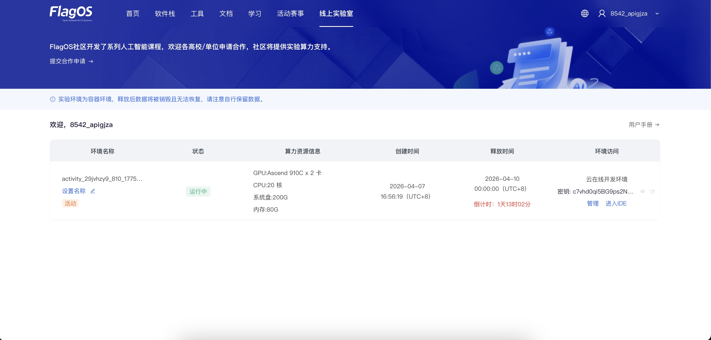
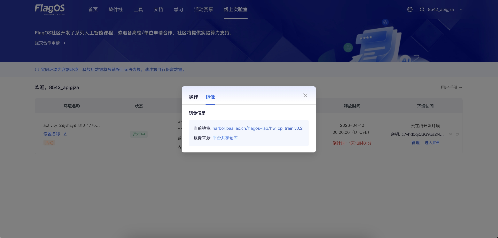
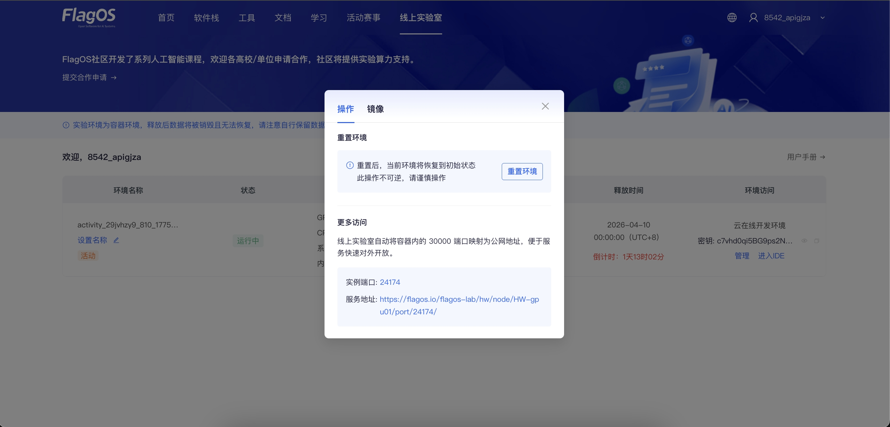

# 线上实验室用户指南

## 快速上手

1. 登录 Flag OS 后，点击右上角的 **线上实验室** 标签页。

2. 查看与你账号关联的所有未释放的环境容器、算力资源详情、访问入口及其他相关信息。  
   

3. 在 **环境访问** 列中，检查镜像信息：
   1. 导航至**密钥**下方，并点击**管理**。
   2. 在弹出的窗口中，点击**镜像**。
      

4. 在 **环境访问** 列中，使用以下任一方式访问云端在线开发环境：
    - **方式一：直接访问开发环境**  
      如需直接访问开发环境，请按以下步骤操作：  
      1. 在 **密钥** 旁点击复制图标，复制密钥。  
      2. 点击 **进入IDE**。在弹出的 Welcome 对话框中粘贴密钥，并点击 **Submit**。  
      
    - **方式二：通过公网访问**  
      如需通过公网访问开发环境，请按以下步骤操作：  
      1. 可将开发环境的服务映射到端口 30000。  
      2. 在 **密钥** 下方点击 **管理**。  
      3. 在弹出的悬浮窗口中，点击 **操作**。在**更多访问**区域中点击**服务地址**链接以打开开发环境。
      

5. 根据显卡类型，通过终端命令查询算力配置信息。  
    - 对于天数加速卡，使用以下命令：

       ```{code-block} bash
       ixsmi
       ```

      
    - 对于华为昇腾加速卡，使用以下命令：

       ```{code-block} python
       npu-smi info
       ```

      

6. 您可以通过以下方式上传或下载代码包、模型等文件：
     - 在 `Workspace` 上点击右键，选择 **Upload...**  
      
     - 在 `Workspace` 上点击右键，选择 **Download...**  
      

```{warning}
实验环境为容器化环境，在释放后所有数据将被永久删除且无法恢复，请务必提前在本地备份数据。
```

关于 Visual Studio Code 的详细使用说明，请参阅：<https://code.visualstudio.com/docs>。

## 重置环境

要将开发环境重置为初始状态，请执行以下步骤：

1. 在**环境访问**列中，导航至**密钥**下方，并点击**管理**。
2. 在弹出的窗口中，点击**操作**。在**重置环境**部分，点击**重置环境**。在**重置环境**弹出窗口中，点击**确定**。
  

```{warning}
此操作不可逆，请谨慎操作。
在环境重置后所有数据将永久删除且无法恢复，请务必提前在本地备份数据。
```
